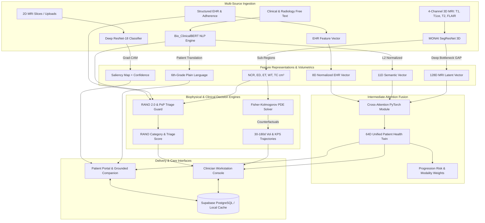

# Healthcare Companion: AI-Powered Cancer Care
### *Multimodal Deep Learning, Biophysical In-Silico Simulation & Patient Health Twin for Brain Cancer*

[](https://www.python.org/)
[](https://pytorch.org/)
[](https://monai.io/)
[](https://streamlit.io/)
[](https://supabase.com/)
[](LICENSE)

---

## 🌟 Overview & Clinical Vision

**Healthcare Companion** is a clinical-grade, multimodal digital twin platform engineered to optimize care trajectories for patients confronting high-grade brain tumors (glioblastomas and high-grade gliomas). The platform bridges clinical engineering—featuring MONAI 3D SegResNet volumetric segmentation, Bio_ClinicalBERT diagnostic NLP, Fisher-Kolmogorov reaction-diffusion biophysical PDE simulation, and cross-attention representation learning—with role-tailored workstations for oncologists and accessible portals for patients and caregivers.

### Key Clinical Capabilities:
- **3D Volumetric Tumor Decomposition**: Isolates Necrotic Core (NCR), Peritumoral Edema (ED), and Enhancing Tumor (ET) across multi-sequence MRI.
- **RANO 2.0 Pseudoprogression (PsP) Guard**: Differentiates treatment-induced radiation necrosis from genuine tumor recurrence within the critical 12-week post-radiotherapy window using rCBV perfusion and MGMT promoter methylation status.
- **Biophysical In-Silico Forecasting**: Solves a 3D reaction-diffusion proliferation-invasion PDE to simulate counterfactual tumor volume and Karnofsky Performance Scale (KPS) trajectories over 30 to 180-day horizons across multiple therapeutic regimens.
- **Patient-Centered Empathetic Translation**: Automatically translates dense radiology reports into reassuring, accessible 6th-grade reading level summaries.
- **Twin-Grounded Companion**: A conversational agent equipped with clinical safety guardrails and cross-modal reasoning that correlates missed medication logs with newly emerging symptoms.

---

## 🏗️ System Architecture



---

## 🔬 Core Architectural Modules

### 1. Medical Imaging & Volumetric Analysis
- **3D SegResNet Architecture**: Built on MONAI (`spatial_dims=3, in_channels=4, out_channels=3`) processing 4-channel NIfTI volumes:
  - `Channel 0`: Necrotic and Non-enhancing Tumor Core (NCR)
  - `Channel 1`: Peritumoral Vasogenic Edema (ED)
  - `Channel 2`: Active Enhancing Tumor (ET)
  - `Derived`: Whole Tumor ($\text{WT} = \text{NCR} \cup \text{ED} \cup \text{ET}$) and Tumor Core ($\text{TC} = \text{NCR} \cup \text{ET}$).
- **128D Bottleneck Vector**: Global Average Pooling (GAP) across the deepest layer produces an anatomical feature vector for intermediate fusion.
- **Offline BraTS Generator**: Synthesizes multi-sequence 3D BraTS volumes with concentric tumor morphology and Gaussian noise for local testing without large raw archives.
- **Deep ResNet-18 2D Brain Tumor Classifier**:
  - Pretrained deep CNN fine-tuned on clinical brain tumor scans.
  - **Holdout Test Set Performance (38 unseen scans)**:
    - **Accuracy**: **89.47%**
    - **Sensitivity (Recall)**: **100.0%** (23/23 tumors detected, 0 False Negatives)
    - **Specificity**: **73.33%**
    - **ROC-AUC**: **0.9652** | **PR-AUC**: **0.9755**
  - **Grad-CAM**: Generates high-resolution saliency maps overlaid on scan slices for visual auditability.

### 2. Clinical Report Understanding & Empathetic Translation
- **Clinical NLP Engine**: Utilizes `Bio_ClinicalBERT` token semantics with domain regularized entity extraction.
- **Diagnostic Entity Parsing**: Extracts tumor anatomical location, margin characteristics, contrast enhancement dynamics, mass effect, midline shift ($\text{mm}$), relative cerebral blood volume ($\text{rCBV}$), and edema extent.
- **Patient-Centered Translation**: Converts dense radiology jargon into reassuring, 6th-grade reading level plain language (e.g., explaining *"perilesional vasogenic edema"* as *"mild, normal fluid swelling around the tumor area without crowding healthy brain structures"*).
- **11-Dimensional Semantic Vector**: L2-normalized continuous embedding representing critical diagnostic features:
  $$\mathbf{v} \in \mathbb{R}^{11}, \quad \|\mathbf{v}\|_2 = 1.0$$

### 3. Biophysical In-Silico Simulation (Fisher-Kolmogorov PDE)
- **Reaction-Diffusion Proliferation & Invasion Solver**:
  $$\frac{\partial c}{\partial t} = \nabla \cdot (D \nabla c) + \rho \cdot c (1 - c) - k_{\text{kill}} \cdot c$$
  - $c(r, t)$: Spatiotemporal tumor cell density.
  - $D$: Cell motility / diffusivity ($\text{cm}^2/\text{day}$).
  - $\rho$: Proliferation rate calibrated by IDH mutation status ($\rho = 0.016/\text{day}$ for Mutant; $0.028/\text{day}$ for Wild-Type).
  - $k_{\text{kill}}$: Therapeutic cytotoxic cell kill calibrated by MGMT promoter methylation ($k_{\text{kill}} = 0.024/\text{day}$ for Methylated; $0.008/\text{day}$ for Unmethylated).
- **Counterfactual Therapeutic Regimens**:
  - `SOC_TMZ`: Standard-of-Care adjuvant Temozolomide ($150\text{--}200\text{ mg/m}^2$, 5/28 days).
  - `DOSE_DENSE`: Accelerated 7/14-day schedule.
  - `HOLD_TMZ`: Treatment pause for hematologic or clinical recovery.
  - `LOMUSTINE`: Second-line nitrosourea alkylating agent.
- **Predictive Trajectory**: Yields projected volumetric trajectories ($\text{cm}^3$) and Karnofsky Performance Scale ($\text{KPS}$, $10\text{--}100$) over 30, 60, 90, and 180 days.

### 4. RANO 2.0 Pseudoprogression (PsP) Guard & Urgency Triage
- **Temporal Rule**: Scans within 12 weeks (84 days) post-radiotherapy completion trigger the PsP evaluation protocol.
- **Perfusion & Molecular Calibration**: Evaluates relative Cerebral Blood Volume ($\text{rCBV}$) against a $1.75$ threshold and checks MGMT methylation. Low rCBV combined with MGMT methylation indicates high probability ($\ge 90\%$) of treatment effect (radiation necrosis) rather than true tumor recurrence.
- **Standardized Categories**: Outputs formal RANO categories (`CR`, `PR`, `SD`, `PD`, `PsP`) and clinical triage urgency scores (`Mild`, `Moderate`, `Critical`).

### 5. Multimodal Intermediate Attention Fusion
- **Cross-Attention PyTorch Module**: Maps three heterogeneous modalities into a shared $64$-dimensional latent token space:
  - SegResNet 3D MRI latent vector: $128\text{-dim} \to 64\text{-dim}$
  - ClinicalBERT report embedding: $11\text{-dim} \to 64\text{-dim}$
  - Structured EHR and adherence vector: $8\text{-dim} \to 64\text{-dim}$
- **Sequence Cross-Attention**: Multi-head attention across tokens with LayerNorm and residual projection yields the unified **64-dimensional Patient Health Twin Vector**, dynamically reporting relative modality influence percentages and tumor progression risk.

### 6. Personalized Care Companion
- **Twin Grounding**: Conversational reasoning strictly anchored in the patient's real-time twin record (latest scan volumes, translated summaries, active medications, missed doses, and logged symptoms).
- **Safety Guardrails**: Explains medical terms, provides reassurance, but **never** issues unconfirmed diagnoses or modifies medication dosages. Automatically flags red-flag symptoms for immediate clinical escalation.
- **Cross-Modal Correlation**: Recognizes actionable links between clinician-verified or patient-logged missed doses (e.g., Levetiracetam) and emerging symptoms (e.g., focal seizure auras).

---

## 🗄️ Database Architecture (Supabase PostgreSQL)

The schema is defined in [`database/supabase_schema.sql`](file:///c:/Users/Tejaswini/Desktop/digital_twin/database/supabase_schema.sql).

### Normalized Tables:
1. `patients`: UUID PK, MRN (unique), demographics, diagnosis location, baseline KPS, care team, and research consent flags.
2. `molecular_profiles`: IDH mutation status, MGMT promoter methylation, and 1p/19q codeletion.
3. `mri_scans`: Serial volumetric measurements ($\text{WT}$, $\text{TC}$, $\text{ET}$, $\text{Edema}$ in $\text{cm}^3$), Dice scores, and estimated $\text{rCBV}$.
4. `clinical_reports`: Uploads by doctors or patients, raw text, parsed JSONB entities, plain-language translations, and severity tags.
5. `medications`: Active prescriptions, dose, frequency, adherence status (`Taken`, `Due`, `Missed`), clinical adherence notes, and update audit trail.
6. `symptom_logs`: Patient entries categorized by symptom type, discrete severity (`Mild`, `Moderate`, `Severe`), onset timestamps, and notes.
7. `twin_timeline`: Longitudinal digital twin evaluations, progression risk scores, RANO 2.0 categories, PsP probability, 64D latent vector, and alert banners.
8. `counterfactual_simulations`: In-silico parameter calibrations, intervention types, and predicted 180-day trajectories.

### Pre-Seeded Patient Profiles:
- **Patient 0042: V. Thanuja** (Age 24, Left Temporal High-Grade Glioma, IDH-Mutant / MGMT-Methylated, Active Chemoradiation)
- **Patient 0043: Marcus Chen** (Age 58, Right Frontal Glioblastoma, IDH-Wildtype / MGMT-Unmethylated, Post-Surgical Adjuvant TMZ)
- **Patient 0044: Priya Sharma** (Age 41, Right Parietal Oligodendroglioma, IDH-Mutant / 1p19q-Codeleted, Surveillance Post-PCV)

---

## 🖥️ User Roles & Workflows

### 🩺 Clinician Workstation & Doctor Portal
- **Doctor Authentication & RBAC Login**: Institutional smart-card SSO simulation and credential authentication for attending neuro-oncologists (Dr. Aris Thorne, Dr. Elena Rostova, Dr. Marcus Vance) with direct assigned patient inspection.
- **Multi-Patient Roster & Inspector**: High-level cohort overview with MRN, age, tumor location, WHO grade, KPS score, molecular biomarkers, and live triage alert badges.
- **Clinical Report Upload & AI Verification Hub**: Ingestion suite supporting drag-and-drop (.txt, .md, .pdf) or 1-click loading from the clinical sample reports library. Executes Bio_ClinicalBERT entity parsing, rCBV thresholding, RANO 2.0 triage classification, 6th-grade empathetic translation, and formal physician electronic sign-off.
- **3D & 2D MRI Diagnostic Suite**: 4-channel BraTS structural sequence dropzone (`.nii` / `.nii.gz`) for MONAI SegResNet volumetric segmentation, plus real-time 2D MRI ResNet-18 inference with Grad-CAM overlays.
- **Medication Governance & Verification Hub**: Prescribe new medications (drug, dose, frequency, instructions) and override/audit adherence status (`Taken`, `Due`, `Missed`) with clinical notes.
- **Consultation Report Generator & Print Console**: Generates formatted consultation summaries with volumetric delta metrics, RANO evaluations, and print-ready CSS (`window.print()`).
- **In-Silico Horizon Simulator**: Interactive "what-if" testing of alternative chemotherapy regimens (SOC vs. Dose-Dense vs. Hold vs. Lomustine) with 30–180 day forecast plots.

### 👤 Patient Portal
- **Home Dashboard**: Dynamic alert banner surfacing critical twin findings, 4 stat cards (Tumor Volume, Medication Adherence %, Symptoms Logged, Next Visit), and quick-action navigation.
- **Patient Document Upload**: Ingestion portal for patients to submit outside pathology, lab, or radiology reports.
- **Quick Symptom Logger**: One-tap buttons (`[Headache]`, `[Vision]`, `[Seizure]`, `[Fatigue]`, `[Speech]`, `[Motor]`), severity selectors, onset time picker, and historical timeline.
- **Scan & Translated Reports**: Side-by-side view comparing original technical radiology jargon against the empathetic 6th-grade translation with 3D volumetric readouts.
- **Medications & Care Companion**: Interactive daily medication schedule with one-tap *"Mark as Taken"* confirmation and grounded conversational AI.
- **Longitudinal Trends**: Interactive multi-axis tracking of serial tumor volumes, weekly symptom frequencies, and 30-day running medication adherence rates.

### 🧠 MRI Evaluator
- Upload or select 2D MRI scans from the clinical library (`data/sample_scans`).
- Real-time deep inference via the trained ResNet-18 model with probability confidence, diagnostic classification, and Grad-CAM saliency overlays.

---

## 📂 Repository Directory Layout

```
digital_twin/
├── database/
│   └── supabase_schema.sql           # Complete Supabase PostgreSQL DDL with RLS & pre-seeds
├── data/
│   ├── sample_reports/               # Standardized clinical consultation & radiology report library
│   │   ├── 01_pseudoprogression_radiation_necrosis.txt # Sample 1: PsP / radiation necrosis (MRN: 0042)
│   │   ├── 02_recurrent_high_grade_progression.txt     # Sample 2: True tumor recurrence (MRN: 0043)
│   │   ├── 03_complete_treatment_response.txt          # Sample 3: Complete durable response (MRN: 0044)
│   │   ├── 04_acute_mass_effect_herniation.txt         # Sample 4: Acute herniation emergency (STAT)
│   │   └── README.md                                   # Clinical parameters & test guide
│   └── sample_scans/                 # Clinical MRI scan dataset for 2D tumor classifier
│       ├── yes/                      # Tumor-positive scans
│       └── no/                       # Tumor-negative scans
├── glioma_digital_twin/
│   ├── models/
│   │   ├── mri_segmenter.py          # MONAI SegResNet 3D volumetric segmentation & BraTS generator
│   │   ├── clinical_nlp.py           # Bio_ClinicalBERT parser & 6th-grade patient translation
│   │   ├── biophysical_solver.py     # Fisher-Kolmogorov 3D reaction-diffusion PDE solver
│   │   ├── triage_engine.py          # RANO 2.0 pseudoprogression guard & triage engine
│   │   ├── multimodal_twin.py        # PyTorch intermediate cross-attention fusion module
│   │   ├── companion_agent.py        # Grounded conversational agent with clinical guardrails
│   │   ├── tumor_classifier.py       # Deep ResNet-18 inference wrapper with Grad-CAM
│   │   ├── train_tumor_model.py      # ResNet-18 training, validation, and benchmarking pipeline
│   │   └── saved_models/
│   │       ├── best_tumor_classifier.pt # Trained ResNet-18 model weights (42.9 MB)
│   │       ├── evaluation_results.json  # Comprehensive test evaluation metrics & benchmarks
│   │       ├── roc_pr_curves.png        # ROC and Precision-Recall curves
│   │       ├── training_curves.png      # Loss and accuracy training trajectories
│   │       ├── confusion_matrix.png     # Holdout test set confusion matrix
│   │       └── test_predictions_gradcam.png # Grad-CAM localization visual validation
│   ├── ui/
│   │   ├── app.py                    # Main Streamlit web application entry point
│   │   └── components/
│   │       ├── doctor_login.py        # Doctor Authentication & Patient Cohort Inspector
│   │       ├── clinician_upload.py    # Clinician Workstation (Roster, 3D/2D Scans, Meds, Report, Simulator)
│   │       ├── report_verification_hub.py # Clinical Report Upload & AI Verification Hub
│   │       ├── patient_dashboard.py   # Patient Portal Home Dashboard & Stat Cards
│   │       ├── report_viewer.py       # Scan details, technical vs. plain translation, patient upload
│   │       ├── symptom_logger.py      # One-tap symptom entry form & timeline
│   │       ├── companion_chat.py      # Medication schedule & grounded Care Companion chat
│   │       ├── longitudinal_trends.py # Volumetric, symptom, and adherence analytics
│   │       └── mri_evaluator.py       # 2D MRI Evaluator with Grad-CAM visualization
│   ├── utils/
│   │   ├── supabase_client.py        # Dual-mode (Supabase + local persistent memory) client
│   │   └── synthetic_data.py         # Multi-sequence NIfTI BraTS volume generator
│   └── run_demo.py                   # Standalone pipeline verification script
├── run_demo.py                       # Root launcher for pipeline verification
├── README.md                         # Comprehensive clinical & technical documentation
└── package.json                      # Workspace configuration
```

---

## 🚀 Quickstart & Execution

### 1. Prerequisites
- Python 3.10 or 3.11
- CUDA-compatible GPU (optional, fully supports CPU execution)

### 2. Environment Setup
```bash
# Clone the repository
git clone https://github.com/Tejaswini2416/healthcare_companion_for_neurology.git
cd healthcare_companion_for_neurology

# Create and activate virtual environment
python -m venv venv
# On Windows:
.\venv\Scripts\activate
# On Linux/macOS:
source venv/bin/activate

# Install required dependencies
pip install torch torchvision torchaudio --index-url https://download.pytorch.org/whl/cu121  # or cpu
pip install monai streamlit transformers scikit-learn pandas numpy matplotlib seaborn scipy supabase
```

### 3. Launch Interactive Web Application
```bash
streamlit run glioma_digital_twin/ui/app.py --server.port=8501
```
Open your browser and navigate to:
```
http://localhost:8501
```

### 4. Run End-to-End Pipeline Verification
Execute the automated test suite that validates the database client, 3D SegResNet segmentation, 2D ResNet-18 classifier, Bio_ClinicalBERT NLP, Fisher-Kolmogorov PDE solver, RANO 2.0 triage guard, cross-attention fusion, and grounded companion agent:
```bash
python run_demo.py --no-launch
```

### 5. Retrain or Evaluate the Brain Tumor Classifier
```bash
python glioma_digital_twin/models/train_tumor_model.py
```

---

## 🚀 Advanced Clinical AI Capabilities (Phase 1: High Clinical Value)

The platform incorporates four enterprise-grade clinical AI capabilities designed to meet hospital standards and enhance patient safety:

### 1. 🌐 Interactive 3D WebGL Volume Viewer (`volume_viewer_3d.py`)
- **Three.js GPU-Accelerated Rendering**: Renders full 3D volumetric models of the brain cortex silhouette, Enhancing Tumor (ET), Peritumoral Edema (ED), and Necrotic Core (NCR).
- **Clinical Controls**: 360° orbital rotation, pan, zoom, sub-region opacity sliders, cinematic auto-rotation, and axial cutaway clipping planes.
- **Embedded Across**: Both the Clinician Workstation (Tab 3: Diagnostic Suite) and Patient Report Viewer.

### 2. 🛡️ GraphRAG Clinical Safety Guard & Knowledge Graph (`graph_rag.py`)
- **Evidence Grounding**: Multi-hop traversal over NCCN Guidelines for Central Nervous System Cancers (v2026.1), AAN Standards, and RANO 2.0 response criteria.
- **Pharmacological Safety Limits**: Hardcoded threshold checks for Stupp protocol adjuvant Temozolomide (ANC $\ge 1,500/\mu\text{L}$, Platelets $\ge 100,000/\mu\text{L}$), antiepileptic non-cessation warnings (Levetiracetam/Keppra), and Dexamethasone tapering rules.
- **Anti-Hallucination Fact Verification**: Dynamically outputs verification confidence scores ($>90\%$) and expandable citation drawers for patient chat and clinician consultation.

### 3. 🚨 Automated Red-Flag Escalation Protocol (`red_flag_alert.py`)
- **Three-Tier Clinical Triage**:
  - **Level 3 (STAT Emergency)**: Acute expressive aphasia, hemiparesis/paralysis, convulsive/status seizures, and acute ICP herniation signs.
  - **Level 2 (Urgent Care Escalation)**: Sensory seizure auras, visual field deficits, and severe unremitting headaches (callback within 4 hours).
  - **Level 1 (Routine)**: Mild fatigue or localized manageable symptoms.
- **SBAR Structured Handoff**: Auto-generates Situation, Background, Assessment, and Recommendation reports.
- **Multi-Channel Dispatch Simulation**: Dispatches alerts via simulated SMS Gateway (`+1 (555) 019-8492`) and Hospital PagerDuty Webhooks (`HTTP 200 Broadcasted`, Priority `P1_STAT` / `P2_HIGH`).
- **Attending Workstation Queue**: Dedicated interactive resolution queue in the Clinician Workstation where oncologists review telemetry and record formal clinical triage notes.

### 4. 🌍 Multi-Language Empathetic Translation & Audio TTS Player (`clinical_nlp.py`, `audio_tts_player.py`)
- **Multilingual Support**: Real-time 6th-grade reading level translation into **Spanish (Español)**, **Hindi (हिंदी)**, **Mandarin (中文)**, **French (Français)**, and **English**.
### 5. 👨‍⚕️ Attending Physician Authentication & Privacy Protection Gate (`doctor_login.py`)
- **Strict Clinical Entry Gate**: To comply with HIPAA/HITECH privacy guidelines, the application boots directly to the **Doctor Authentication Portal**. All Protected Health Information (PHI), patient names, Medical Record Numbers (MRNs), diagnostic locations, and MRI scans remain locked and undisclosed until an attending physician signs in.
- **1-Click Express Physician Authentication**: Instant smart-card simulation for active attending specialists:
  - **Dr. Aris Thorne, MD, PhD** (*Chief of Neuro-Oncology*) - Assigned patients: V. Thanuja (0042), Priya Sharma (0044).
  - **Dr. Elena Rostova, MD** (*Associate Professor of Surgical Neuro-Oncology*) - Assigned patient: Marcus Chen (0043).
  - **Dr. Marcus Vance, MD** (*Chief of Diagnostic Neuroradiology*) - Cross-cohort coverage.
- **Standard Institutional NPI Login**: Full credential authentication form supporting department routing and session persistence.
- **Assigned Cohort Inspector**: Upon login, the attending physician gains access to their assigned patient roster, active patient context switcher, and comprehensive tabs for Demographics, Molecular & Genomic Biomarkers, 3D MRI Volumetrics, Medications, and Symptom Dynamics.
- **Secure Sign-Out**: One-click physician logout returns the application immediately to the locked authentication gate.

---

## ⚡ Supabase PostgreSQL Direct Real-Time Connectivity

Healthcare Companion connects directly to **Supabase PostgreSQL** for real-time symptom streaming, longitudinal MRI scan tracking, and bidirectional clinical alerts between patients and oncologist workstations.

```
┌────────────────────────────────────────────────────────┐
│ STREAMLIT UI: PATIENT & CLINICIAN WORKSTATIONS        │
│ • Doctor RBAC entry gate & cohort privacy             │
│ • Real-time symptom streaming (@st.fragment 5s)        │
│ • Interactive MPR 3D slice segmentations               │
│ • Real-time in-basket doctor escalations               │
└──────────────────────────┬─────────────────────────────┘
                           │ Direct PostgREST / Realtime
                           ▼
┌────────────────────────────────────────────────────────┐
│ SUPABASE POSTGRESQL CLOUD ENGINE (public schema)       │
│ • public.patients           • public.mri_scans         │
│ • public.symptom_logs       • public.clinical_reports  │
│ • public.medications        • public.twin_timeline     │
│ • public.molecular_profiles • public.counterfactual... │
└──────────────────────────┬─────────────────────────────┘
                           │ Graceful offline fallback
                           ▼
┌────────────────────────────────────────────────────────┐
│ LOCAL RESILIENT ENGINE (Zero-friction demo mode)       │
│ • Pre-seeded cohorts: MRN 0042, 0043, 0044             │
└────────────────────────────────────────────────────────┘
```

### 1. Connecting to Live Supabase
You can supply your Supabase project credentials in **either of two ways**:
1. **Environment File** (`.env`):
   ```env
   SUPABASE_URL=https://your-project.supabase.co
   SUPABASE_KEY=your-anon-or-service-role-key
   NEXT_PUBLIC_SUPABASE_URL=https://your-project.supabase.co
   NEXT_PUBLIC_SUPABASE_ANON_KEY=your-anon-or-service-role-key
   ```
2. **Streamlit Secrets** (`.streamlit/secrets.toml`):
   ```toml
   SUPABASE_URL = "https://your-project.supabase.co"
   SUPABASE_KEY = "your-anon-or-service-role-key"

   [supabase]
   url = "https://your-project.supabase.co"
   key = "your-anon-or-service-role-key"
   ```

### 2. Creating Database Tables & Schema
To populate a fresh Supabase database with all patient profiles (V. Thanuja, Marcus Chen, Priya Sharma), historical MRI volumetrics, medications, and clinical reports:
- Open your Supabase project dashboard -> **SQL Editor**.
- Copy and run the complete idempotent DDL script from `database/supabase_schema.sql`.
- Once tables are created, all scan evaluations, symptom logs, and clinical reports sync automatically with your remote PostgreSQL instance.

### 3. Real-Time Streaming & Resilience
- **Automated Fallback**: If Supabase cloud is temporarily unreachable or tables are initializing, the client seamlessly routes queries through the high-speed local resilient cohort cache without application disruption.
- **Instant Scan Sync**: Evaluated MRI scans and biophysical volumetrics ($WT$, $TC$, $ET$, $rCBV$) are written directly into `public.mri_scans`.
- **Live Symptom Feed**: Real-time multi-device symptom streaming with zero-lag patient transmission.

---

## 📊 Model Benchmark Results

### Deep ResNet-18 Brain Tumor Classifier
Evaluated on holdout clinical test partition ($20\%$ unseen scans):

| Metric | Result | Description |
|:---|:---:|:---|
| **Test Accuracy** | **89.47%** | Overall correct diagnostic classifications |
| **Sensitivity (Recall)** | **100.0%** | Critical: **0 False Negatives** across all tumor scans ($23/23$) |
| **Specificity** | **73.33%** | Non-tumor identification rate |
| **Precision** | **85.19%** | Positive predictive value |
| **F1 Score** | **0.9200** | Harmonic mean of precision and recall |
| **ROC-AUC** | **0.9652** | Area under the Receiver Operating Characteristic curve |
| **PR-AUC** | **0.9755** | Area under the Precision-Recall curve |

#### Confusion Matrix (38 Unseen Holdout Scans):
- **True Positives (TP)**: `23`
- **True Negatives (TN)**: `11`
- **False Positives (FP)**: `4`
- **False Negatives (FN)**: `0`

---

## 🔒 Security, Compliance & Ethical Disclaimer

> **IMPORTANT CLINICAL NOTICE**:
> **Healthcare Companion** is an investigational clinical research platform designed to assist medical professionals and enhance patient engagement. It is **not** an FDA-cleared independent medical diagnostic device. All treatment plans, surgical interventions, prescription modifications, and therapeutic halts must be evaluated and confirmed by licensed oncologists and multidisciplinary tumor boards.
>
> **Data Privacy & Governance**:
> Database access is governed by PostgreSQL Row-Level Security (RLS) policies. In production deployments with live Supabase instances, all PHI/PII data transmissions must comply with HIPAA, GDPR, and institutional IRB research standards.

---

## 📄 License
This project is licensed under the Apache License 2.0. See the `LICENSE` file for details.
